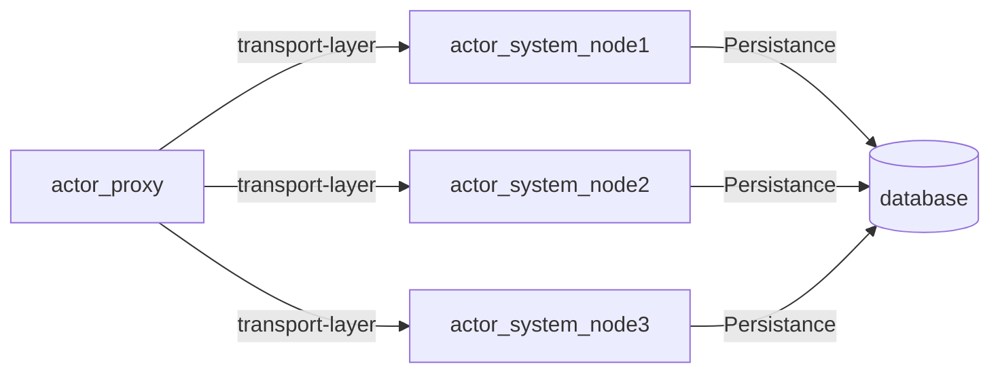
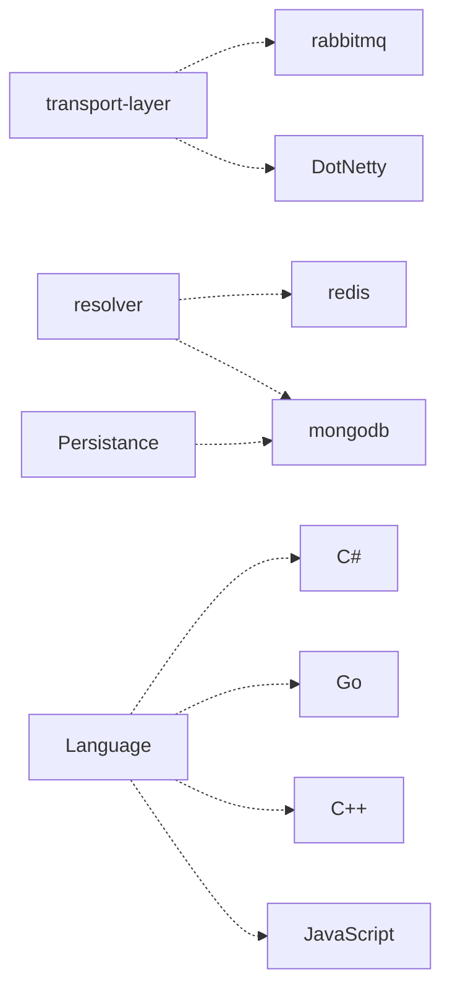
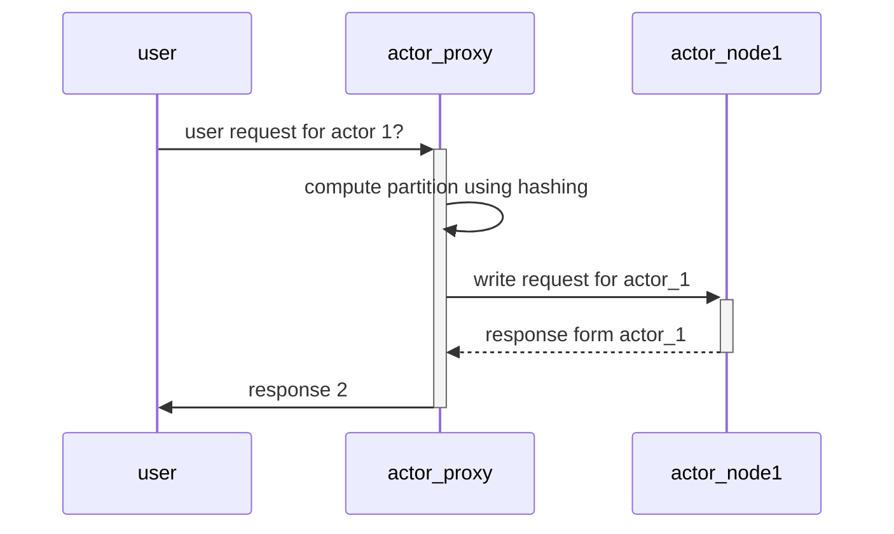
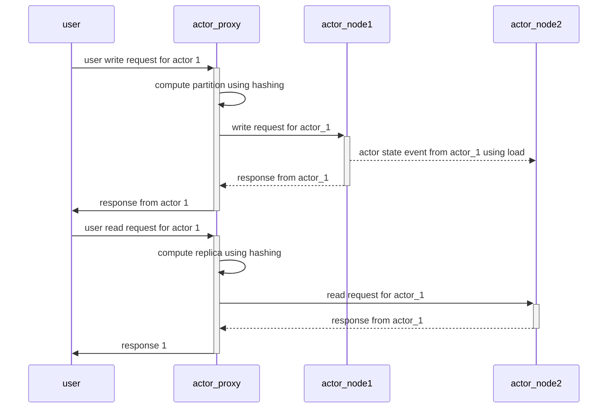
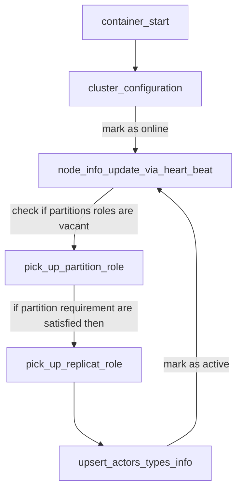
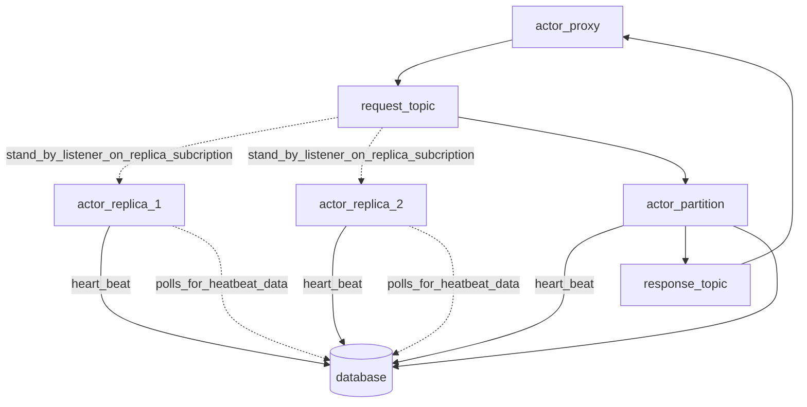
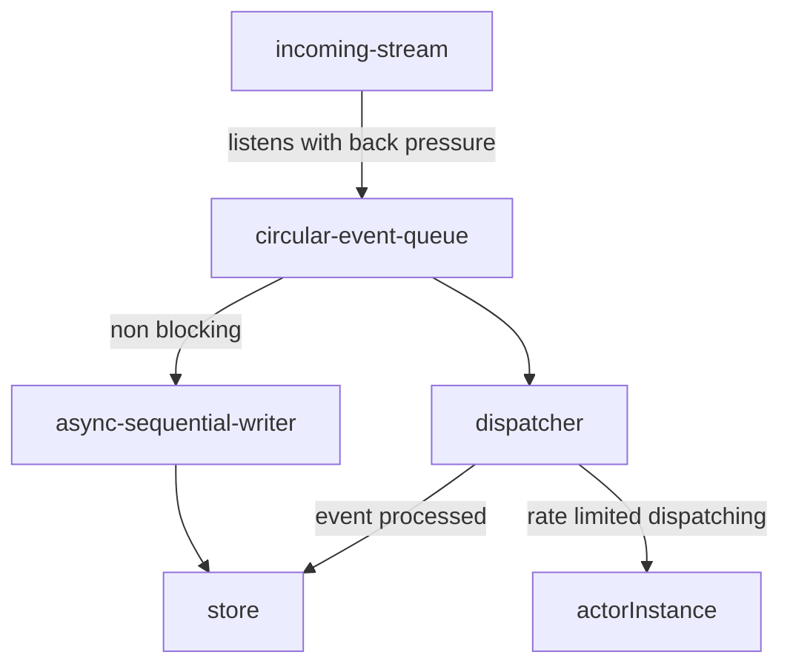

# Delegactor ActorFramework (CSP)
# In-house ActorFramework

We have decided to build an inhouse actor ActorFramework that will be simple and easy to build and maintain for us. rather than depending on a general purpose heavy weight ActorFramework such as

- Orleans
- Akka
- Proto Actor.

## Business requirement

We need to be able to run concurrent transations and perform entity updates in a scalable manner.

key areas that we will be using this are

- Keeping track of order updates
- Payment transations
- Gps Feed updates and related data
- Inventory counts
- feed and post metrics
- simple metrics
- coupon grabs at scale
- keep metrics during games integration

## Learning

we have evaluated Orleans, ProtoActor ActorFrameworks

- Orleans

we had observed a huge Performance issue / latency, even for simple cases it initial request take time. this is due the design requirements of a orleans to handle billion entities in a geo distirubute enviornment. second and biggest complexity was with startup time and evolution. Twice during its usage we had to completely re initialize our grain data as we tried to evolve our system.

- ProtoActor

The simplest ActorFramework out there to start and work with.it is performant but we observed it had issues with multiple grains in the same cluster kind.
also a plethora of issues that are open and will impact us. such as scaling beyond a few instances and outages

## implementation

- C# primary candidate language but at the same time language neutral
- Decoupled and componented by design
- simple and reliable protocol
- focused on our business and technical requirements.

### design

1. Decoupled persistance
2. Decoupled Transport ActorFramework
3. Should support the following
    1. Notify
    2. Request - Response
    3. Pub - Sub
4. Rpc should be message driven using interoperable message formats

#### Persistance

We will off load this to the developer with few components that will help them to achive their goals

#### Transport

For our use case we will use zero mq as our backbone.

#### Diagram



---

Tech Stack
---



----

SequenceDiagram

----



---

With replica

----



---

### Detailed overview of our no master strategy

- instead using a database to sync cluster state and source of truth
- we avoid gossiping too by this approach.
- downside is that the database becomes the critical component

---

Usually in most of the distributed system we can see there there is a concept of master and its election. Often it is the responsibility of master to resolve and maintain topology view and management of cluster.

Inspired from Orleans, we decided to use database as a critical component to avoid the complexity of implementing a raft or similar consensus pattern for the overview of cluster the topology, then followed Service fabric inspired Actor Pattern where Actors are always partitoned over the key and assigned to a partiton which improves the latency of invocation, this inturn comes with a cost that a node that containing the node goes down then all the events or actions to that particular actor will halt until a node comes and picks up the partion role.

As long as we are using a persistant messaging system for Rpc we will not have a failure.

We will have to find a way to improve the healing time without optin in for a gossip or broadcast protocols. this is something that will look into after we have implemented live re_partitoning & replicas

we scope our engineering effort to node bound actor partitioning and replica. Given our current business strategy we should be comfortable with this design. **we can think about actor bound partitioning and distriburtion when the time hits.**



sudo code for start up sequence

---

```text
    Number of nodes: N
    Number of partitions : P
    Number of replicas : R
    Number of active nodes : A
    Number of online nodes : O

    conditions are 
    A < O <P <R < N
    P <= R & R % P ==0
```
---

GetListenerId method for partitions and replicas

```csharp
    public int GetListenerId(ActorClusterInfo clusterInfo)
    {  if (NodeType == nameof(ActorClient))
            {
                return 0;
            }

            var nodeBundle = NodeRole == "partition"
                ? clusterInfo.PartitionsNodes
                : clusterInfo.ReplicaNodes / clusterInfo.PartitionsNodes - 1;
            return PartitionNumber!.Value % nodeBundle;
    }
```

---

```text
    pick_partition_role:
    for i from 0-N in partition_role nodes
        find missing partition_role
        if found then atomically grab partition_role i
            if failed to grab 
                - then try again until loop break
            else 
            mark itself as active with i as the partition index
    
    if failed to pick up partition_role:

    for i from 0-N in replica_role nodes
        find missing replica_role
        if found then atomically grab replica_role i
            if failed to grab 
                - then try again until loop break
            else 
            mark itself as active with i as the replica index

    for time 1:N
        look out for open partition role 
        if found goto: pick_partition_role
```

---

#### Rabbitmq transport-layer

---



In our system heart beats are basically a token with an expiry that varies can for every heart beat,
when heart beat is expired from a actor_partition or actor had failed to update its heartbeat for the given window, it will stop consuming event/messages - flushes its storage. since the actor_partition heartbeat had expired the next in line will pick up the role and keeps it slot vacant which the restarted actor_partition can join in with actor_replica role or a new instance can pick up.

#### Read replica mode

Read methods can be marked with an attibute so that the request event will have a subscription pattern appended, which will be picked up by replicas to serve

eg:

    Partition listen to     :  request.JAZEEM-PC.ActorSystem.0.partition   
    Replicas listen to      :  request.JAZEEM-PC.ActorSystem.0.replica (replicas are bounded)

#### Scaling

In our cluster each instance will be either a partition or a replica.

Actor system have a control plan for cluster management, which is mostly a broadcast system and configuration updater.

- we will stick to mathematical approachs is to reduce and avoid delays and election mechanisms which is otherwise required.

first it will update the clusters expected state.

    node will listen to change events/ database polls

    if a configuration change has been observed then : 

    - on scaling out existing partitions/replicas terminate irrelevant actors. Then new nodes will pick up the open partitions with appropriate actors. 
    
    - on scaling in partitions that are outside the bounds will terminate itself for the partitions. for the partitions that had irrelevant actor instances according to the new configuration they will be terminated and then the servcie will shut down its listener gracefully and re-listen to the new channel events
    
    To find irrelevant actors and terminate recomputing hashes will help then  and will asking actors to self destruct.
---
    For clients when a partition encouters a message that is irrelevant, the message will be rerouted to respective partition with a header to indicate the client that there is cluster a configuration change.
    the last partition will periodically cross check active message subscriptions and then will  (to be done)

#### State Persistance and propogation

By design we have of loaded state management to the developer but will provide a simple key value store for handling state. we prefer to use simple storage for storing state as there is no theoretical limit to how many objects can be stored.

we can use state propogation between partitions and nodes directly.
Haven't thought whether to use rmq itself for state propogation or use a secondary channel to establish communication between parttition and replica. for now we will use replica to use storage to serve data.

#### Actor event propogation

Actors can opt in for pub sub. where by one actor might be interested in actions or method invocation of other actors.

pub sub can be by actors of the same type or actors of a different type.

one down/design constrain is that we will only intimate actors that are alive. this is to avoid bringing in all the dormant actors online at the same time.


#### MailBox Pattern

Currently we don't have this in place. we are leveraging Rmq for event persistance. that helped us to proceed with our initial system.

As a next step we need to unblock rabbitmq. this will have to be done using a mailbox pattern. this can in theory improve the Performance we have an aim to make it reliable



---
Taking inspiration from this pattern **https://lmax-exchange.github.io/disruptor/disruptor.html**

---
