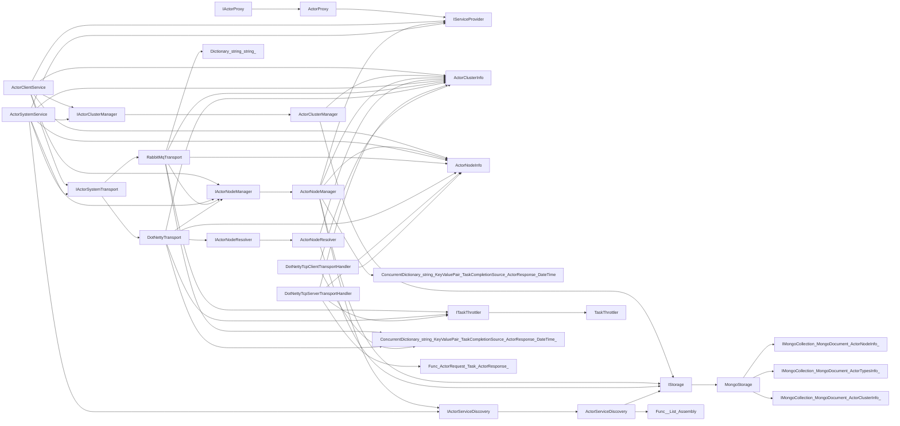

# May not be upto date

```mermaid
graph LR


IActorProxy --> ActorProxy

ActorProxy --> IServiceProvider
ActorClientService  -->   ActorClusterInfo
ActorClientService  -->   ActorNodeInfo
ActorClientService  -->   IActorClusterManager
ActorClientService  -->   IActorNodeManager
ActorClientService  -->   IServiceProvider
ActorClientService  -->   IActorSystemTransport

IActorClusterManager --> ActorClusterManager

ActorClusterManager --> IStorage 
ActorClusterManager --> ActorClusterInfo 

IActorNodeManager --> ActorNodeManager

ActorNodeManager --> ConcurrentDictionary_string_KeyValuePair_TaskCompletionSource_ActorResponse_DateTime
ActorNodeManager --> IActorServiceDiscovery 
ActorNodeManager --> IServiceProvider 
ActorNodeManager --> IStorage 
ActorNodeManager --> ActorClusterInfo 
ActorNodeManager --> ActorNodeInfo 

IActorNodeResolver --> ActorNodeResolver

ActorNodeResolver --> ActorClusterInfo
ActorNodeResolver --> IStorage


IActorServiceDiscovery --> ActorServiceDiscovery

ActorServiceDiscovery --> IStorage
ActorServiceDiscovery --> Func__List_Assembly


ActorSystemService --> ActorClusterInfo 
ActorSystemService --> ActorNodeInfo 
ActorSystemService --> IActorClusterManager 
ActorSystemService --> IActorNodeManager 
ActorSystemService --> IActorSystemTransport 
ActorSystemService --> IServiceProvider 
ActorSystemService --> IActorServiceDiscovery 

ITaskThrottler --> TaskThrottler

IStorage --> MongoStorage

MongoStorage --> IMongoCollection_MongoDocument_ActorNodeInfo_ 
MongoStorage --> IMongoCollection_MongoDocument_ActorTypesInfo_ 
MongoStorage --> IMongoCollection_MongoDocument_ActorClusterInfo_ 

IActorSystemTransport --> RabbitMqTransport
IActorSystemTransport --> DotNettyTransport

RabbitMqTransport --> ConcurrentDictionary_string_KeyValuePair_TaskCompletionSource_ActorResponse_DateTime_              
RabbitMqTransport --> ITaskThrottler[ITaskThrottler<type> ]
RabbitMqTransport --> IActorNodeManager 
RabbitMqTransport --> ActorNodeInfo 
RabbitMqTransport --> ActorClusterInfo 
RabbitMqTransport --> Dictionary_string_string_ 

DotNettyTransport --> ConcurrentDictionary_string_KeyValuePair_TaskCompletionSource_ActorResponse_DateTime_    
DotNettyTransport --> ITaskThrottler[ITaskThrottler<type>]
DotNettyTransport --> ActorNodeInfo 
DotNettyTransport --> ActorClusterInfo 
DotNettyTransport --> IActorNodeResolver 
DotNettyTransport --> IActorNodeManager 


DotNettyTcpServerTransportHandler --> Func_ActorRequest_Task_ActorResponse_ 
DotNettyTcpServerTransportHandler --> ActorClusterInfo 
DotNettyTcpServerTransportHandler --> ActorNodeInfo 
DotNettyTcpServerTransportHandler --> ITaskThrottler[ITaskThrottler<type> ]

DotNettyTcpClientTransportHandler --> ConcurrentDictionary_string_KeyValuePair_TaskCompletionSource_ActorResponse_DateTime_   
DotNettyTcpClientTransportHandler --> ActorClusterInfo 
DotNettyTcpClientTransportHandler --> ActorNodeInfo 

```
